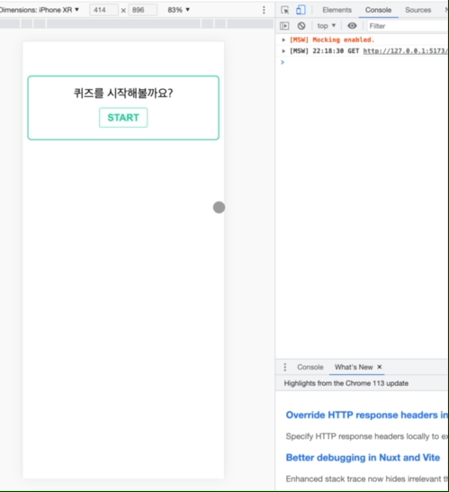

# ✅ react-quiz-app

배포 링크 : https://react-quiz-app-lemon.vercel.app/

## 데모

## 🛠️ 주요 기술 스택

- `react-typescript(Vite)` `eslint` `prettier`

- `react-router-dom` `emotion` `Chart.js` `redux-toolkit`

- `Jest(Vitest)` `react-testing-library` `msw`

## 🙋‍♂️ 프로젝트 소개

- `https://opentdb.com` 에서 제공하는 오픈 소스 API를 이용하여 구현한 퀴즈 앱입니다.

- **Jest(Vitest), react-testing-library, MSW**를 사용하여 컴포넌트 단위 테스트를 진행했습니다.

- 오픈 API에서 제공하는 API는 퀴즈 리스트를 불러오는 것 뿐이기 때문에 데이터 저장은 **세션 스토리지**를 이용했습니다. (**redux-persist** 라이브러리 사용)

- 모든 페이지 컴포넌트에서 "퀴즈"라는 공통된 관심사를 두고 있기 때문에 이 관심사를 효과적으로 한 곳에서 관리하기 위해 전역 상태 라이브러리(**redux**)를 사용했습니다.

## 📂 src 주요 폴더 구조

- `__tests__/` : 테스트 환경설정 및 컴포넌트 단위 테스트를 위한 유틸 함수를 관리합니다.

- `apis/` : 네트워크 통신을 하는 api를 관심사별로 구분하여 관리합니다.

- `lib/` : 의존성 라이브러리를 사용하는 등 유틸 함수를 관리합니다.

- `mocks/` : 목 데이터와 api를 모킹한 핸들러를 관리합니다.

- `pages/` : 페이지 단위의 컴포넌트를 관리합니다.

- `routes/` : 페이지 단위의 컴포넌트를 routeTable로 관리하며 Router 컴포넌트가 위치합니다.

- `components/` : 특정 관심사에 종속되지 않는 atom, 특정 관심사와 연관된 컴포넌트가 위치합니다.

- `hooks/` : 특정 관심사에 대한 주요 로직을 훅으로 관리합니다.

- `store/` : 특정 관심사에 대한 상태와 상태 변화에 대한 로직을 관리합니다.

## 🎯 프로젝트에서 집중한 부분 : 테스팅

`테스트 코드`를 작성하는 부분에 가장 집중했는데, 컴포넌트 단위의 테스트, 페이지(컴포넌트) 단위의 테스트, hook 테스트, 유틸 함수 테스트 등 이 모든 로직을 테스트 해야하는 것인지 쉽게 감이 오지 않았습니다.

> 사용자의 입장에서 테스트한다.

몇몇 아티클을 참고하며 **프론트엔드 테스팅** 방법에 대해 학습했습니다. 결과적으로 **사용자의 입장에서 테스트**한다는 것을 중심으로 테스트 코드를 작성했습니다.

컴포넌트의 내부 상태가 어떻게 변하는지 여부는 사용자에게는 중요하지 않고(사실 개발자에게는 상태가 화면과 직결되기 때문에 중요하지만요) 사용자에게 중요한 부분은 **어떤 행동을 취하기 전이나 취한 이후에** 화면이 어떻게 바뀌는지가 중요합니다. 따라서 이 부분을 중심으로 테스트 코드를 작성하려 했고, **테스트 케이스마다 상태 값을 바꿔주면서 기대되는 화면을 테스트** 했습니다.

> 비즈니스 로직을 중심으로 테스트한다.

어떤 값을 받아서 그대로 렌더링하는 컴포넌트의 경우에는, 눈으로 한 번만 확인하면 되기 때문에 굳이 `react-testing-library` 로 테스트할 필요가 없다고 판단했습니다. 테스트 코드 작성은 중요하지만 그만큼 개발자의 피로도도 높아지기 때문에 계속해서 변화가 일어날 수 있는 부분을 찾으려 노력하며 테스트를 작성했습니다.

하지만 관리하고 있는 상태, 즉 비즈니스 로직과 관련하여 `dispatch`로 인해 상태가 바뀌었을 때는 반드시 테스트 코드를 작성했습니다. 반드시 작성한 이유는 로직과 관련된 부분이기 때문에 리팩터링을 하거나 기능의 변화(수정, 삭제, 추가)가 생겼을 때 엄청난 도움을 주기 때문입니다.

> 조건에 따라 다르게 렌더링이 되는 부분은 테스트한다.

비즈니스 로직과 연관된 부분이지만, **특정 조건**에 따라 사용자에게 보여줘야하는 화면이 달라져야한다면 반드시 테스트했습니다.

이 프로젝트에서는 예를 들어, 퀴즈를 풀고 있지 않은데 url을 통해 강제로 `퀴즈결과페이지`, `오답노트페이지`에 진입한다면 사용자에게 피드백을 보여주는 부분입니다. `홈페이지` `퀴즈페이지` `퀴즈결과페이지` `오답노트페이지` 4개의 컴포넌트는 사용자가 퀴즈를 풀고 있지 않을 때, 풀고 있을 때, 모두 풀었을 때 보여주는 피드백 화면이 조금씩 달라져야 하기 때문에 테스트했습니다.

## 📚 참고한 자료들

### 공식문서

- [Testing-Library](https://testing-library.com/docs/queries/about/)

- [리덕스 테스팅 가이드](https://redux.js.org/usage/writing-tests)

### 아티클

- [모던 프론트엔드 테스트 전략 — 1편(Testing Overview)](https://blog.mathpresso.com/%EB%AA%A8%EB%8D%98-%ED%94%84%EB%A1%A0%ED%8A%B8%EC%97%94%EB%93%9C-%ED%85%8C%EC%8A%A4%ED%8A%B8-%EC%A0%84%EB%9E%B5-1%ED%8E%B8-841e87a613b2)

- [MSW를 활용하는 Front-End 통합테스트](https://fe-developers.kakaoent.com/2022/220825-msw-integration-testing/)

- [Vitest with React Testing Library](https://www.robinwieruch.de/vitest-react-testing-library/)
