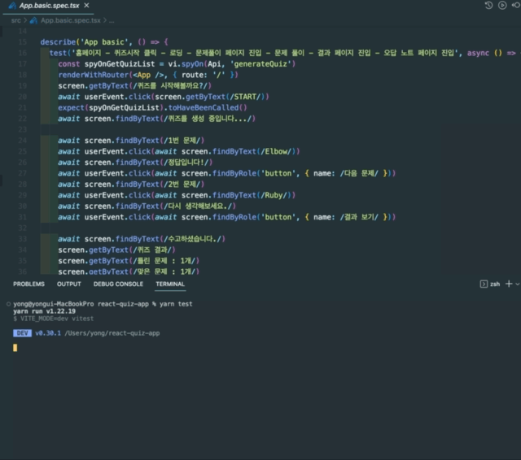

# ✅ react-quiz-app

- `https://opentdb.com` 에서 제공하는 오픈 소스 API를 이용하여 구현한 퀴즈 앱입니다.

- 배포 링크 : https://react-quiz-app-lemon.vercel.app/

## Demo

> msw(브라우저) 개발환경에서 실행한 모습입니다.


## Skills

- `react-typescript(Vite)` `eslint` `prettier`

- `react-router-dom` `emotion` `Chart.js` `redux-toolkit`

- `Jest(Vitest)` `react-testing-library` `msw`

## 실행 방법

이 저장소를 클론하고 의존성 모듈을 설치해주세요.

```
1. git clone ...

2. yarn install
```

#### msw 개발 환경에서 실행하기

1. `yarn msw`
2. `yarn dev:msw`

#### 일반 개발 환경에서 실행하기

1. `yarn dev`

#### App 테스트 실행하기

1. `yarn msw`
2. `yarn test`


